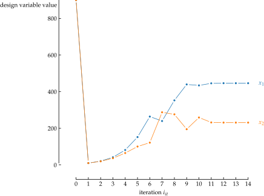
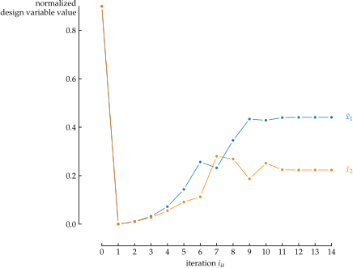
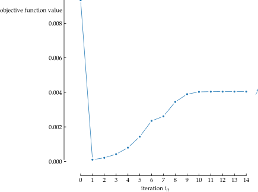
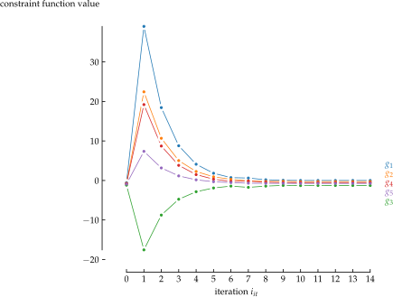

<p align=center></p>

[](https://pypi.org/project/desoptpy)
[](https://pypi.org/project/DesOptPy/)
[](https://github.com/e-dub/desoptpy)
[](https://pypistats.org/packages/desoptpy)
[](https://blue.readthedocs.io/)

# DesOptPy
DESign OPTimization in PYthon

## Summary
DesOptPy (DESign OPTimization in PYthon) was designed a Python-based tool for design optimization, especially of lightweight structures and mechancial systems. This package integrates optimization algorithms from pyOpt and pyGMO, with expansion to others being possible. This allows for complex handling of large-scale optimization problems typical of structural design optimization. The goal of this project is to design a versatile and general optimization toolbox for design optimization in which the setup of an optimization problem is easily, quickly, efficiently and effectively, allowing colleagues and students to dive into optimization problems without difficulty.  It is also meant to be modular and easily expanded.  Though developed for design optimization of mechanical structures, DesOptPy has been written to be flexible and, therefore, optimization problems of other disciplines can be applied.

## Installation

```bash
git clone https://github.com/e-dub/DesOptPy
cd DesOptPy
sudo python setup.py install
```


## Quick start
Import OptimizationProblem from the library DesOpyPy

```python
from DesOptPy import OptimizationProblem
```
Define your model to be optimized as a class with a function where the design-variable-dependent system equations are evaluated. 

```python
class Model:
    def analysis(self):
    y = x**2
    z = x*5

```
Then setup your optimization problem. First initialize the problem with the model.
```python
OptProb =  OptimizationProblem(Model)
```
Define the primal analysis for the optimiaztion.
```python
OptProb.Primal = "analysis"
```
Set the design variables, including initial values and bounds, and the optmization functions.
```python
OptProb.x = "x"
OptProb.x0 = 2
OptProb.xL = 1
OptProb.xU = 10
OptProb.f = "y"
OptProb.g = ["z"]
OptProb.gLimit = [17]
```
You are now ready to optimize. Commence optimization run with the following command:
```python
OptProb.optimize()
```

## Plotting

Convergence plotting can be carried out after the optimization with the following command (defaults shown):

```python
OptProb.plotConvergence(
    show=True, savePDF=False, savePNG=False, saveSVG=False, saveTikZ=False
)
```

This function has the possibility of showing or saving in PDF, PNG, SVG and TikZ (PGF) format.

An example of the plots created:
<p align=left></p>
<p align=left></p>
<p align=left></p>
<p align=left></p>
<p align=left></p>


Before and after bar plotting can be carried out after the optimization with the following command (defaults shown):

```python
OptProb.plotBeforeAfter(
    show=True, savePDF=False, savePNG=False, saveSVG=False, saveTikZ=False
)
```

As above, this function has also the possibility of showing or saving in PDF, PNG, SVG and TikZ (PGF) format (TikZ untested).

An example of the plots created:
<p align=left></p>
<p align=left></p>
<p align=left></p>


## Application examples


## Related software and developments

pyUngewiss
EasyBeam
Simuli

## Release history

#### January 5, 2022
Release of version 2022 released. Fully reworked version.

### Previous version (major)
Found under
https://github.com/e-dub/DesOptPy1

#### July 27, 2019
Release of version 2019.

#### July 30, 2016
Release of version 1.3..

#### June 26, 2016
Release of version 1.2.

#### November 18, 2015
Release of version 1.1.

#### November 16, 2015
Release of version 1.02.

#### November 10, 2015
Release of version 1.01.

#### October 18, 2015
Initial public release of DesOptPy on GitHub and PyPI - the Python Package Index.

## Contact
I would also appreciate feedback to any success (or unsuccess) stories with the use of this software.  If you should find errors in the code or documentation, have suggestions for improvements or wish a cooperation, please use the issue function in GitHub.

## Attribution
...

## Contributors

The file AUTHORS.rst has a complete list of contributors to the project.

## License

DesOptPy is a free and open software released under the ??? license. See file LICENSE.


## Acknowledgment
The work involved with the 2021 release is supported by the project RTD 2020 – TN201Q LighOpt Lightweight engineering of multibody systems with design optimization funded by the Free University of Bozen-Bolzano.


## Copyright

Copyright (c) 2022
Erich Wehrle
All rights reserved.


## Publications
Wehrle, E. and Gufler, V. (2021)
Lightweight engineering design of nonlinear dynamic systems with gradient-based structural design optimization
Proceedings of the Munich Symposium on Lightweight Design 2020, Springer Berlin Heidelberg, 44-57,
DOI: 10.1007/978-3-662-63143-0_5.

Gufler, V., Wehrle, E. and Zwölfer, A. (2021)
A review of flexible multibody dynamics for gradient-based design optimization
Multibody System Dynamics, 53, 379-409,
DOI: 10.1007/s11044-021-09802-z.

Gufler, V., Wehrle, E. and Vidoni, R. (2021)
Sensitivitätsanalyse flexibler Mehrkörpersysteme für die Unsicherheitsanalyse und Entwurfsoptimierung
IFToMM D-A-CH 2021.

Wehrle, E.; Gufler, V. & Vidoni, R.
Optimal in-operation redesign of mechanical systems considering vibrations---A new methodology based on frequency-band constraint formulation and efficient sensitivity analysis
Machines, 2020, 8, 11,
DOI: 10.3390/machines8010011.

Gufler, V., E. Wehrle, and R. Vidoni. (2020) Multiphysical design optimization of multibody systems: Application to a Tyrolean weir cleaning mechanism. In Mechanisms and Machine Science, pp. 459–467.
DOI: 10.1007/978-3-030-55807-9_52

Gufler, V., E. Wehrle, and R. Vidoni (2020). Mehrkörperdynamik und Entwurfsoptimierung unter Unsicherheit vom Rechenreinigungsmechanismus eines Tiroler Wehres. In IFToMM D-A-CH.

Wehrle, E.; Palomba, I. & Vidoni, R. (2018)
In-operation structural modification of planetary gear sets using design optimization methods
Mechanism Design for Robotics, Springer International Publishing, 395-405,
DOI: 10.1007/978-3-030-00365-4_47.

Wehrle, E.; Palomba, I. & Vidoni, R. (2018)
Vibrational behavior of epicyclic gear trains with lumped-parameter models: Analysis and design optimization under uncertainty
ASME 2018 International Design Engineering Technical Conferences & Computers and Information in Engineering Conference IDETC/CIE 2018, American Society of Mechanical Engineers,
DOI: 10.1115/detc2018-86427.

Wehrle, E. (2018)
Modeling and design optimization of dynamic structural systems under uncertainty: Application to epicyclic gearing
World Congress in Computational Mechnanics.

Boursier Niutta, C.; Wehrle, E. J.; Duddeck, F. & Belingardi, G. (2018)
Surrogate modeling in design optimization of structures with discontinuous responses: A new approach for ill-posed problems in crashworthiness design
Structural and Multidisciplinary Optimization, 57, 1857-1869,
DOI: 10.1007/s00158-018-1958-7.

Wehrle, E. J.; Concli, F.; Cortese, L. & Vidoni, R. (2017)
Design optimization of planetary gear trains under dynamic constraints and parameter uncertainty
ECCOMAS Thematic Conference on Multibody Dynamics.

Wehrle, E. J. (2015). Design optimization of lightweight space frame structures considering crashworthiness and parameter uncertainty. Dr.-Ing. diss., Lehrstuhl für Leichtbau, Technische Universität München.

Wehrle, E. J., Q. Xu, and H. Baier (2014). Investigation, optimal design and uncertainty analysis of crash-absorbing extruded aluminium structures. Procedia CIRP 18, 27–32.

and a number of further master, bachelor and semester theses.
