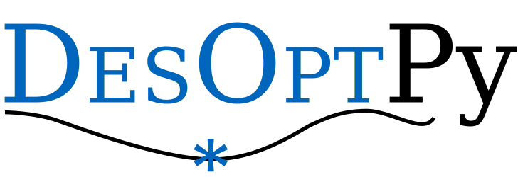

# DesOptPy
DESign OPTimization in PYthon

## Plotting

Convergence plotting can be carried out after the optimization with the following command:

'''
OptProb.plotConvergence()
'''

This function has the possibility of showing or saving in PDF, PNG, SVG and TikZ (PGF) format.

An example of the plots created:

## Checklist

### General
- [x] Ask Veit and Johannes for what they would like as users
- [x] new github repository
- [ ] Update logo
- [ ] Release
- [ ] Publish on Open Source Software?

### Check
- [x] check fNorm, seems funky at times
- [x] check xNorm...
- [ ] check when gNorm=True and gLimit=0

### Examples
- [ ] set up example with SiMuLi
- [x] set up example with EasyBeam
- [ ] example with ungewiss
- [ ] set up example with Kratos
- [ ] set up example with Ansys (pyAnsys)
- [x] old DesOptPy examples
- [ ] topology optimization example (Hofer)

### Code general
- [x] variable function for primal and sens
- [x] different way to define design variables with x vector
- [x] add initial step to calc nx, ng and source of algorithm!
- [ ] make all values numpy arrays
- [ ] return arrays!!! not lists, for gradients important!
- [ ] remove parameter pyOptAlg = True
- [ ] add option, fType min max
- [ ] normalize and denormalize as vector operations? not index assignment?`
- [ ] test gradients that they work well!!!
- [ ] nit for nongrad alg
- [ ]  ResultReport
- [ ] sensitivity analysis
- [ ]  Postprocessing for shadow prices
- [ ] echo or debug level? what is standard?
- [ ]  Variable linking?
- [x] Normalization for each design variables or global (currently for each)???
- [x] Normalization for each contraint or global (currently for each)???
- [ ] different normalizations for design variables
- [x] default normlaization for xnorm
- [x] default normlaization for fnorm
- [x] default normlaization for gnorm
- [ ] equality constraints?
- [ ] add range constraints?
- [x] default gtype: upper bound
- [ ] rconval -> rConVal

### Print
- [ ] general beautification
- [ ] e.g. "<1000" instead of "1000, upper"???

### Plotting
- [x] convergence plots
- [x] save as png, pdf, pgf
- [ ] bar charts?
- [ ] f,gMax together vs. i_it?

### File handling
- [x]  File handling save all evaluation data
- [x]  File handling and run results folder (no run only modelname with time stamp)
- [ ]  filehandling for saving all evaluation to find if it is a new iteration or a finite differencing iteration (or also step length)

### History etc
- [x] read in history at end
- [ ] renorm etc with history!!! Iteration values, Optimal values

### Algorithm specific
- [ ] Cobyla pyopt nIt, now only neval
- [ ] if cobyla, sens false

### Further algorithms
- [ ] add pygmo
- [ ] add deap
https://deap.readthedocs.io/en/master/tutorials/advanced/constraints.html
- [ ] add cvxopt
http://cvxopt.org/userguide/index.html
- [ ] add nlopt
https://nlopt.readthedocs.io/en/latest/
- [x]  add scipy optimization
- [ ]  add or-tools?
- [ ]  add Hybrid Cellular Automata
https://developers.google.com/optimization/introduction/pythonself.xL
- [x] add algorithm list?
- [ ]  Algorithm options
- [x] add avail optimization algorithms, updated by setup? possible?
- [ ] scipy also without gradients
- [ ] pyopt interface different file

### Surrogating
- [ ]  surrogating?
- [ ]  sampling and ploting of design space

### Monitoring
- [ ] Optimization live monitoring!
- [ ] bokeh stream
https://www.youtube.com/watch?v=WgyTSsVtc7o

## Release history

### August ??, 2021
DesOptPy version 2021 released. Fully reworked version.

### July 27, 2019
DesOptPy version 2019 released.

### July 30, 2016
DesOptPy version 1.3 released.

### June 26, 2016
DesOptPy version 1.2 released.

### November 18, 2015
DesOptPy version 1.1 released.

### November 16, 2015
DesOptPy version 1.02 released.

### November 10, 2015
DesOptPy version 1.01 released.

### November 8, 2015
The website is currently a work in progress and being built.  Check back for updates.

### October 18, 2015
Initial public release of DesOptPy on GitHub and PyPI - the Python Package Index.

## Contact
I would also appreciate feedback to any success (or unsuccess) stories with the use of this software.  If you should find errors in the code or documentation, have suggestions for improvements or wish a cooperation, please use the issue function in GitHub.

## Acknowledgment
The work involved with the 2021 release is supported by the project RTD 2020 – TN201Q LighOpt Lightweight engineering of multibody systems with design optimization funded by the Free University of Bozen-Bolzano.

