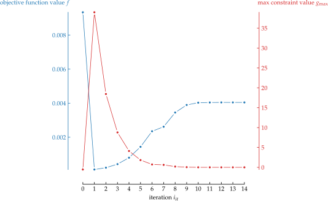
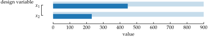

<p align=center></p>

[](https://pypi.org/project/desoptpy)
[](https://pypi.org/project/DesOptPy/)
[](https://github.com/e-dub/desoptpy)
[](https://pypistats.org/packages/desoptpy)
[](https://blue.readthedocs.io/)

# DesOptPy

DESign OPTimization in PYthon

## Summary
DesOptPy (DESign OPTimization in PYthon) was designed a Python-based tool for design optimization, especially of lightweight structures and mechancial systems. This package integrates optimization algorithms from pyOpt and pyGMO, with expansion to others being possible. This allows for complex handling of large-scale optimization problems typical of structural design optimization. The goal of this project is to design a versatile and general optimization toolbox for design optimization in which the setup of an optimization problem is easily, quickly, efficiently and effectively, allowing colleagues and students to dive into optimization problems without difficulty.  It is also meant to be modular and easily expanded.  Though developed for design optimization of mechanical structures, DesOptPy has been written to be flexible and, therefore, optimization problems of other disciplines can be applied.

## Installation

```bash
sudo python setup.py install
```


## Quick start
Import OptimizationProblem from the library DesOpyPy

```python
from DesOptPy import OptimizationProblem
```
Define your model to be optimized as a class with a function where the design-variable-dependent system equations are evaluated. 

```python
class Model:
    def analysis(self):
    y = x**2
    z = x*5

```
Then setup your optimization problem. First initialize the problem with the model.
```python
OptProb =  OptimizationProblem(Model)
```
Define the primal analysis for the optimiaztion.
```python
OptProb.Primal = "analysis"
```
Set the design variables, including initial values and bounds, and the optmization functions.
```python
OptProb.x = "x"
OptProb.x0 = 2
OptProb.xL = 1
OptProb.xU = 10
OptProb.f = "y"
OptProb.g = ["z"]
OptProb.gLimit = [17]
```
You are now ready to optimize. Commence optimization run with the following command:
```python
OptProb.optimize()
```

## Plotting

Convergence plotting can be carried out after the optimization with the following command (defaults shown):

```python
OptProb.plotConvergence(
    show=True, savePDF=False, savePNG=False, saveSVG=False, saveTikZ=False
)
```

This function has the possibility of showing or saving in PDF, PNG, SVG and TikZ (PGF) format.

An example of the plots created:
<p align=left></p>
<p align=left></p>
<p align=left></p>
<p align=left></p>
<p align=left></p>


Before and after bar plotting can be carried out after the optimization with the following command (defaults shown):

```python
OptProb.plotBeforeAfter(
    show=True, savePDF=False, savePNG=False, saveSVG=False, saveTikZ=False
)
```

As above, this function has also the possibility of showing or saving in PDF, PNG, SVG and TikZ (PGF) format (TikZ untested).

An example of the plots created:
<p align=left></p>
<p align=left></p>
<p align=left></p>


## Application examples

## Publications
Gufler, V. (2019). Multibody dynamics and optimal design of a Tyrolean weir cleaning mechanism. Master’s thesis, Free University of Bozen-Bolzano.

Gufler, V., E. Wehrle, and R. Vidoni. Multiphysical Design Optimization of Multibody Systems: Application to a Tyrolean Weir Cleaning Mechanism. In Mechanisms and Machine Science, pp. 459–467. Springer International Publishing.

Gufler, V., E. Wehrle, and R. Vidoni (2020a). Mehrkörperdynamik und Entwurfsoptimierung unter Unsicherheit vom Rechenreinigungsmechanismus eines Tiroler Wehres. In IFToMM D-A-CH.

Gufler, V., E. Wehrle, and R. Vidoni (2020b). Multiphysical design optimization of multibody systems: Application to a Tyrolean weir cleaning mechanism. In 3rd International Conference of IFToMM Italy.

Gufler, V., E. Wehrle, and R. Vidoni (2021). Sensitivitätsanalyse flexibler Mehrkörpersysteme für die Unsicherheitsanalyse und Entwurfsoptimierung. In IFToMM D-A-CH 2021.

Wehrle, E. and V. Gufler (2021). Lightweight engineering design of nonlinear dynamic systems with gradient-based structural design optimization. In Proceedings of the Munich Symposium on Lightweight Design 2020. Springer.

Wehrle, E. J. (2015). Design optimization of lightweight space frame structures considering crashworthiness and parameter uncertainty. Dr.-Ing. diss., Lehrstuhl für Leichtbau, Technische Universität München.

Wehrle, E. J., Q. Xu, and H. Baier (2014). Investigation, optimal design and uncertainty analysis of crash-absorbing extruded aluminium structures. Procedia CIRP 18, 27–32.

...and a number of further master, bachelor and semester theses.

[gears, etc]


## Related software and developments

pyUngewiss
EasyBeam
Simuli

## Release history

#### August ??, 2021
Release of version 2021 released. Fully reworked version.

#### July 27, 2019
Release of version 2019.

#### July 30, 2016
Release of version 1.3..

#### June 26, 2016
Release of version 1.2.

#### November 18, 2015
Release of version 1.1.

#### November 16, 2015
Release of version 1.02.

#### November 10, 2015
Release of version 1.01.

#### October 18, 2015
Initial public release of DesOptPy on GitHub and PyPI - the Python Package Index.

## Contact
I would also appreciate feedback to any success (or unsuccess) stories with the use of this software.  If you should find errors in the code or documentation, have suggestions for improvements or wish a cooperation, please use the issue function in GitHub.

## Attribution

If you make use of this code, please cite the `JOSS <http://joss.theoj.org>`_
paper::

    @article{DesOptPy2021,
      doi = {},
      url = {},
      year = {},
      publisher = {},
      volume = {},
      number = {},
      author = {},
      title = {'DesOptPy: DESign OPTimization in PYthon'},
      journal = {The Journal of Open Source Software}
    }

Please also cite the Zenodo DOI |DOI| as a software citation - see the
`documentation
<http://gala.adrian.pw/en/latest/index.html#citation-and-attribution>`_ for up
to date citation information.

## Contributors

The file AUTHORS.rst has a complete list of contributors to the project.

## License

DesOptPy is a free and open software released under the ??? license. See file LICENSE.


## Acknowledgment
The work involved with the 2021 release is supported by the project RTD 2020 – TN201Q LighOpt Lightweight engineering of multibody systems with design optimization funded by the Free University of Bozen-Bolzano.


## Copyright

Copyright (c) 2021
Erich Wehrle
All rights reserved.

