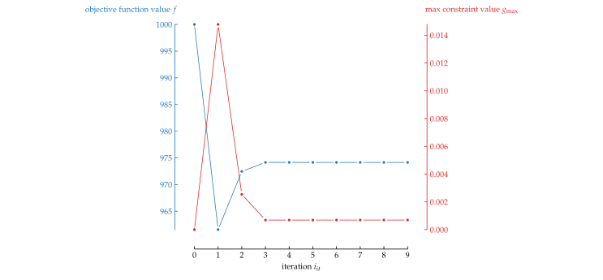

<p align=center></p>

# DesOptPy
DESign OPTimization in PYthon

[](https://pypi.org/project/desoptpy)
[](https://pypi.org/project/DesOptPy/)
[](https://github.com/e-dub/desoptpy)
[](https://pypistats.org/packages/desoptpy)


## Summary
DesOptPy (DESign OPTimization in PYthon) was designed a Python-based tool for design optimization, especially of lightweight structures and mechancial systems. This package integrates optimization algorithms from pyOpt and pyGMO, with expansion to others being possible. This allows for complex handling of large-scale optimization problems typical of structural design optimization. The goal of this project is to design a versatile and general optimization toolbox for design optimization in which the setup of an optimization problem is easily, quickly, efficiently and effectively, allowing colleagues and students to dive into optimization problems without difficulty.  It is also meant to be modular and easily expanded.  Though developed for design optimization of mechanical structures, DesOptPy has been written to be flexible and, therefore, optimization problems of other disciplines can be applied.

## Plotting

Convergence plotting can be carried out after the optimization with the following command:

```
OptProb.plotConvergence()
```

This function has the possibility of showing or saving in PDF, PNG, SVG and TikZ (PGF) format.

An example of the plots created:
<p align=left></p>
<p align=left></p>
<p align=left></p>
<p align=left></p>
<p align=left></p>


## Checklist

### General
- [x] Ask Veit and Johannes for what they would like as users
- [x] new github repository
- [ ] Result file name? DesOpt$ModelName$Alg$TimeStamp
- [x] Update logo
- [ ] Release
- [ ] Publish on Open Source Software?
- [ ] move checklist from README
- [ ] Update pypi (pip)
- [ ] choose code style and use automatic code formatter, i.e. black: https://github.com/psf/black
- [ ] merge into old DesOptPy repository. Is this possible?
- [ ] finish project description here: https://pypi.org/project/DesOptPy/
- [ ] include the following on README?
[](https://repology.org/project/python:desoptpy/versions)
[](https://readthedocs.org/projects/desoptpy/?badge=latest)
[](https://github.com/e-dub/desoptpy)

[](https://github.com/e-dub/desoptpy/actions?query=workflow%3Aci)
[](https://codecov.io/gh/e-dub/desoptpy)
[](https://lgtm.com/projects/g/e-dub/desoptpy)

[](https://github.com/psf/black)

### Check
- [x] check fNorm, seems funky at times
- [x] check xNorm...
- [ ] check when gNorm=True and gLimit=0

### Examples
- [ ] set up example with SiMuLi
- [x] set up example with EasyBeam
- [ ] example with ungewiss
- [ ] set up example with Kratos
- [ ] set up example with Ansys (pyAnsys)
- [x] old DesOptPy examples
- [ ] topology optimization example (Hofer)

### Code general
- [x] variable function for primal and sens
- [x] different way to define design variables with x vector
- [x] add initial step to calc nx, ng and source of algorithm!
- [ ] make all values numpy arrays
- [ ] return arrays!!! not lists, for gradients important!
- [ ] remove parameter pyOptAlg = True
- [ ] add option, fType min max
- [ ] normalize and denormalize as vector operations? not index assignment?
- [ ] nit for nongrad alg
- [ ]  ResultReport
- [ ] sensitivity analysis
- [ ]  Postprocessing for shadow prices
- [ ] echo or debug level? what is standard?
- [ ]  Variable linking?
- [x] Normalization for each design variables or global (currently for each)???
- [x] Normalization for each contraint or global (currently for each)???
- [ ] different normalizations for design variables
- [x] default normlaization for xnorm
- [x] default normlaization for fnorm
- [x] default normlaization for gnorm
- [ ] equality constraints?
- [ ] add range constraints?
- [x] default gtype: upper bound
- [ ] rconval -> rConVal
- [ ] sensivity analysis for gVector
- [ ] mix form of constraints for scalara and vectors

### Print
- [ ] general beautification, color?
- [ ] e.g. "<1000" instead of "1000, upper"???

### Plotting
- [x] convergence plots
- [x] save as png, pdf, pgf
- [ ] bar charts?
- [ ] f,gMax together vs. i_it? yes. No "tuft" labels and colored non-connected y axes, blue (objective) left, red (max constraint) right.
- [ ] custom color scheme or atleast tab10?

### File handling
- [x]  File handling save all evaluation data
- [x]  File handling and run results folder (no run only modelname with time stamp)
- [ ]  filehandling for saving all evaluation to find if it is a new iteration or a finite differencing iteration (or also step length)

### History etc
- [x] read in history at end
- [ ] renorm etc with history!!! Iteration values, Optimal values

### Algorithm specific
- [ ] Cobyla pyopt nIt, now only neval
- [ ] if cobyla, sens false
- [ ] CONMIN returns too many design variables, this should be filtered after optimization

### Further algorithms
- [ ] add pygmo
- [ ] add deap
https://deap.readthedocs.io/en/master/tutorials/advanced/constraints.html
- [ ] add cvxopt
http://cvxopt.org/userguide/index.html
- [ ] add nlopt
https://nlopt.readthedocs.io/en/latest/
- [x]  add scipy optimization
- [ ]  add or-tools?
- [ ]  add Hybrid Cellular Automata
https://developers.google.com/optimization/introduction/pythonself.xL
- [x] add algorithm list?
- [ ]  Algorithm options
- [x] add avail optimization algorithms, updated by setup? possible?
- [ ] scipy also without gradients
- [ ] pyopt interface different file

### Surrogating
- [ ]  surrogating?
- [ ]  sampling and ploting of design space

### Monitoring
- [ ] Optimization live monitoring!
- [ ] bokeh stream
https://www.youtube.com/watch?v=WgyTSsVtc7o

## Application examples

## Publications
Gufler, V. (2019). Multibody dynamics and optimal design of a Tyrolean weir cleaning mechanism. Master’s thesis, Free University of Bozen-Bolzano.

Gufler, V., E. Wehrle, and R. Vidoni. Multiphysical Design Optimization of Multibody Systems: Application to a Tyrolean Weir Cleaning Mechanism. In Mechanisms and Machine Science, pp. 459–467. Springer International Publishing.

Gufler, V., E. Wehrle, and R. Vidoni (2020a). Mehrkörperdynamik und Entwurfsoptimierung unter Unsicherheit vom Rechenreinigungsmechanismus eines Tiroler Wehres. In IFToMM D-A-CH.

Gufler, V., E. Wehrle, and R. Vidoni (2020b). Multiphysical design optimization of multibody systems: Application to a Tyrolean weir cleaning mechanism. In 3rd International Conference of IFToMM Italy.

Gufler, V., E. Wehrle, and R. Vidoni (2021). Sensitivitätsanalyse flexibler Mehrkörpersysteme für die Unsicherheitsanalyse und Entwurfsoptimierung. In IFToMM D-A-CH 2021.

Wehrle, E. and V. Gufler (2021). Lightweight engineering design of nonlinear dynamic systems with gradient-based structural design optimization. In Proceedings of the Munich Symposium on Lightweight Design 2020. Springer.

Wehrle, E. J. (2015). Design optimization of lightweight space frame structures considering crashworthiness and parameter uncertainty. Dr.-Ing. diss., Lehrstuhl für Leichtbau, Technische Universität München.

Wehrle, E. J., Q. Xu, and H. Baier (2014). Investigation, optimal design and uncertainty analysis of crash-absorbing extruded aluminium structures. Procedia CIRP 18, 27–32.

...and a number of further master, bachelor and semester theses.

[gears, etc]


## Related software and developments

pyUngewiss
EasyBeam
Simuli

## Release history

#### August ??, 2021
Release of version 2021 released. Fully reworked version.

#### July 27, 2019
Release of version 2019.

#### July 30, 2016
Release of version 1.3..

#### June 26, 2016
Release of version 1.2.

#### November 18, 2015
Release of version 1.1.

#### November 16, 2015
Release of version 1.02.

#### November 10, 2015
Release of version 1.01.

#### October 18, 2015
Initial public release of DesOptPy on GitHub and PyPI - the Python Package Index.

## Contact
I would also appreciate feedback to any success (or unsuccess) stories with the use of this software.  If you should find errors in the code or documentation, have suggestions for improvements or wish a cooperation, please use the issue function in GitHub.


## Acknowledgment
The work involved with the 2021 release is supported by the project RTD 2020 – TN201Q LighOpt Lightweight engineering of multibody systems with design optimization funded by the Free University of Bozen-Bolzano.


